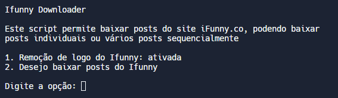

# Ifunny-Downloader [](https://github.com/e43b/Anibunker-Downloader/)

###### [ English](README.md) | [ Português](README-ptbr.md)

Ifunny-Downloader is a versatile tool designed to download posts from the Ifunny website [ifunny](https://ifunny.co/).

## How to Use

1. **Make sure you have Python installed on your system.**
2. **Clone this repository:**

    ```sh
    git clone https://github.com/e43b/Ifunny-Downloader/
    ```

3. **Navigate to the project directory:**

    ```sh
    cd Ifunny-Downloader
    ```

4. **Choose your desired language:**

    - The `codeen` folder contains the English version.
    - The `codept` folder contains the Portuguese version.

5. **Run the main script:**

    ```sh
    python main.py
    ```

6. **Follow the instructions in the menu to choose what to download or customize the program.**

## Features

- **Individual and Batch Download**: Download individual posts or multiple posts sequentially by entering their URLs separated by commas.
- **Remove Ifunny Logo**: Automatically remove the Ifunny logo from downloaded images.



### Usage

To use the Ifunny Downloader, provide the URLs of the posts you want to download, separated by commas. For example:

```
https://ifunny.co/picture/huh-there-s-wo-enemies-let-s-see-whose-those-5zRlotuXB , https://br.ifunny.co/picture/eu-o-que-um-homein-como-voce-ilwmsMsXB,https://ifunny.co/picture/what-wild-opinion-Q7drZr4YB, https://br.ifunny.co/video/i2V9Zm2YB
```

### Project Information and Support

- **Creator**: E43b
- **GitHub**: [E43b on GitHub](https://github.com/e43b)
- **Discord**: [Join the community on Discord](https://discord.gg/Q6nQ3vsWTF)
- **Project Repository**: [Ifunny-Downloader Repository](https://github.com/e43b/Ifunny-Downloader)

For questions, feedback, or to join the community, visit the [Discord server](https://discord.gg/Q6nQ3vsWTF) or explore the [GitHub repository](https://github.com/e43b/Ifunny-Downloader).

### Support the Project

If you find this tool useful and would like to support its continued development, consider making a donation. Your contribution helps keep the project active and develop new features.

#### Make a donation by accessing [this link](https://oxapay.com/donate/40874860).

## Contributions

This project is open-source, and you are encouraged to contribute to improvements and new features. Feel free to submit suggestions, report issues, or send pull requests through the [official GitHub repository](https://github.com/e43b/Ifunny-Downloader/) or via our [Discord](https://discord.gg/Q6nQ3vsWTF).
